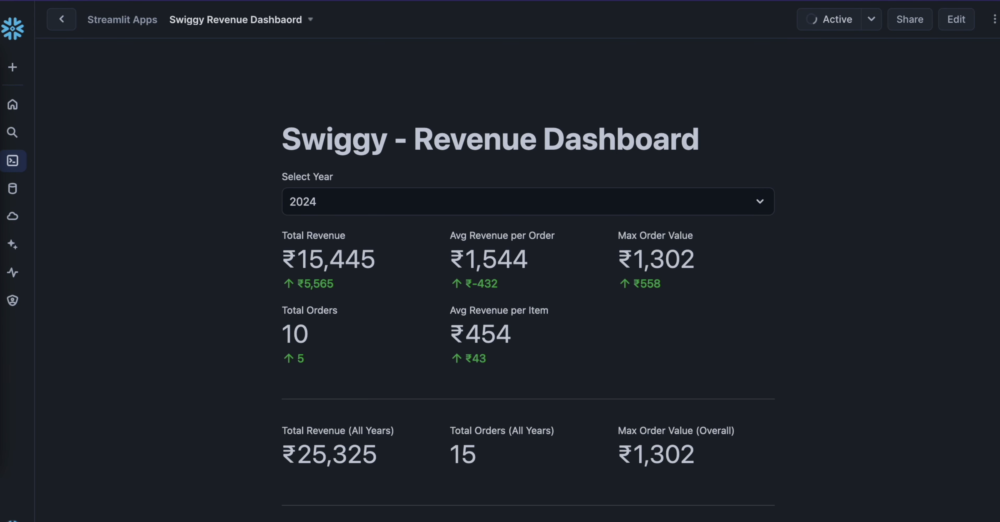

# Swiggy End-to-End Data Engineering Project

This project demonstrates how food aggregators like Swiggy can build robust, scalable data pipelines using Snowflake.  
It covers the entire data engineering lifecycle—from raw data ingestion to transformation, modeling, and visualization.

---

## Overview

This project simulates a real-world data engineering scenario for a food delivery platform. It involves:

- Ingesting raw CSV data into Snowflake using Snowsight and the COPY command.
- Implementing a three-layer data warehouse architecture: Staging, Cleansing, and Consumption.
- Designing fact and dimension tables to support analytical queries.
- Applying data masking policies for sensitive information.
- Building an interactive dashboard using Streamlit to visualize key performance indicators (KPIs).

---

## Architecture

The data pipeline follows a structured approach:

1. **Data Ingestion**: Raw CSV files are loaded into the staging layer using Snowflake's internal stage and the COPY command.
2. **Data Cleansing**: Data is transformed and cleaned in the cleansing layer.
3. **Data Consumption**: Final, cleaned data is stored in the consumption layer, ready for analysis and reporting.

---

## Technologies Used

- **Snowflake** – Cloud-based data warehousing platform
- **SQL** – For data manipulation and transformation
- **Snowsight** – Snowflake’s web interface
- **Streamlit** – For dashboard development in Python

---

## Prerequisites

- Snowflake account (trial or enterprise)
- Python environment with `streamlit` installed
- Basic familiarity with SQL and data warehousing concepts

